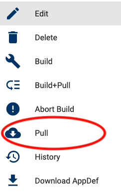
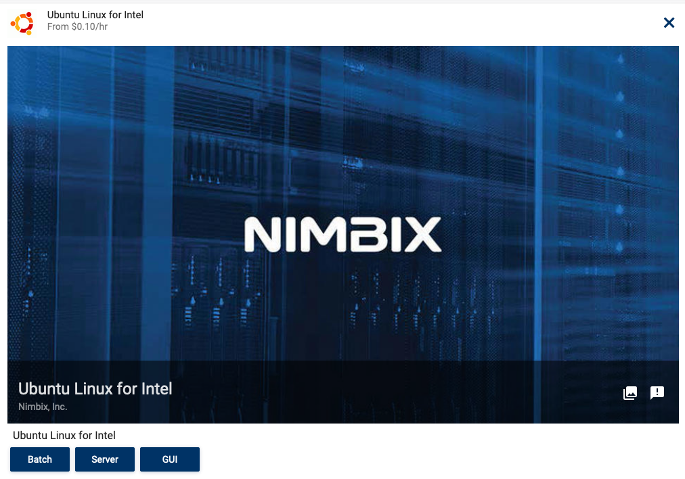
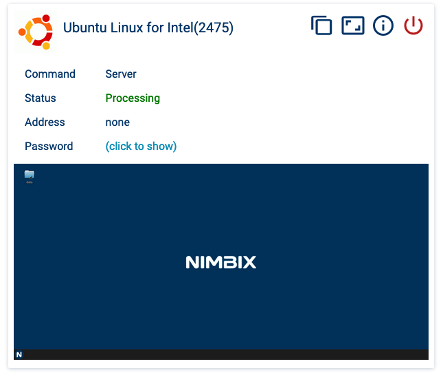
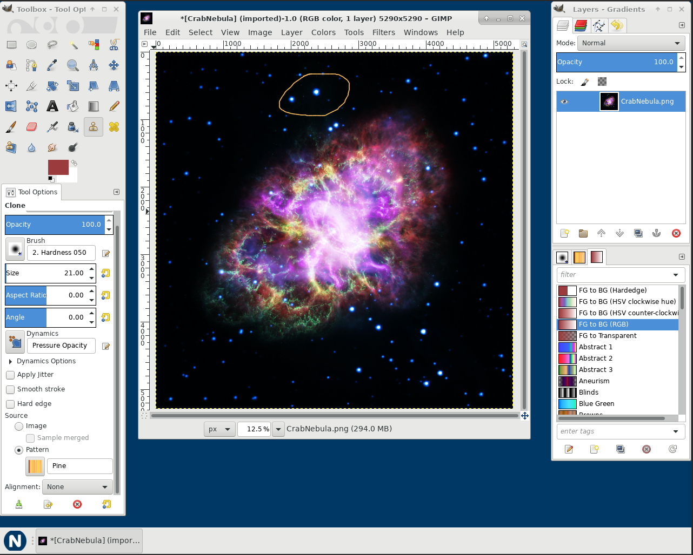

# JARVICE Application Definition Guide

The JARVICE Application Definition (AppDef) Reference describes the application interface for applications that are deployed on JARVICE with PushToCompute. This guide will walk through creating an AppDef for common application use cases on the JARVICE platform. 

Refer to this [link](https://jarvice.readthedocs.io/en/latest/appdef/) for complete documentation.

## Contents

* [Using AppDef to Customize Applications in JARVICE](#using-appdef-to-customize-applications-in-jarvice)
* [Default AppDef Template](#default-appdef-template)
* [Shell AppDef Template](#shell-appdef-template)
* [Batch AppDef Template](#batch-appdef-template)
* [Web service AppDef Template](#web-service-appdef-template)
* [Jupyter Notebook AppDef Template](#jupyter-notebook-appdef-template)
* [GUI application AppDef Template](#gui-application-appdef-template)


## Using AppDef to Customize Applications in JARVICE

All applications in JARVICE are created with the PushToCompute flow. PushToCompute is a full continuous integration/continuous deployment (CI/CD) pipeline for applications on the JARVICE platform. See [here](https://jarvice.readthedocs.io/en/latest/cicd/) for a complete overview.

Adding an AppDef to an application enables the owner to customize a variety of components including: the application card, available workflows, workflow arguments, and connection options.

All new JARVICE applications will use the default AppDef template until it is replaced by the application owner. There are two options available to update an AppDef:

1) Add the AppDef to the application's container

The following snippet can be added to the end of an application's Dockerfile:

```bash
COPY AppDef.json /etc/NAE/AppDef.json
# Verify AppDef is valid
RUN curl --fail -X POST -d @/etc/NAE/AppDef.json https://api.jarvice.com/jarvice/validate
```

The application on JARVICE will be updated after a PushToCompute Pull or Build+Pull request is complete.

2) Upload an AppDef from the PushToCompute editor

* Open the editor by clicking the stacked menu in the upper left corner


* Select `APPDEF` option at the top right and click `LOAD FROM FILE` button 


## Default AppDef Template

All new applications will use the default AppDef template.

Each AppDef contains the following sections:

#### name

Name that appears on the application icon

#### description

Description that appears on the application card

#### author

Author listed on the application icon

#### licensed

Is a license included with the application? `false` indicates an additional license is required

#### classification

Categories available on the JARVICE platform to filter applications


E.g. Software Development, Artificial Intelligence, Machine Learning, etc

#### machines

List the eligible machines an application can use.

[Machines](https://status.jarvice.com/) available on the NIMBIX cloud

#### vault-type

A Vault is a user's persistent storage mounted on `/data`. An application can restrict which vault types can be used

#### image

Base64 image data of icon to use for an application card.

```bash
cat image.png | base64 -w0
```

#### commands

A command describes a workflow provided by an application. The default template provides `Batch`, `Server`, and `GUI` options. 

### Sample Application

The different work flows are illustrated by `nimbix/ubuntu-desktop:xenial` example available on DockerHub. 

Create a new PushToCompute application by:

1. Select PushToCompute tab on the menu on the right
2. Click the `New` icon in the middle of the page
3. Fill in `App ID` (e.g. `myapp`)
4. Fill in 'Docker Repository' with `nimbix/ubuntu-desktop:xenial`
5. Click the `OK` button in the lower right corner
6. Click on the application menu and select Pull




The application icon will update when the Pull completes


The AppDef for `nimbix/ubuntu-desktop:xenial` sets the `name`, `author`, and `image` keys shown above. The additional components on the icon are the `App ID` (bottom right corner) and permissions setting (lock in top right corner). All new applications on JARVICE are set to private and will appear with the lock icon. Application can be made public following [these](https://jarvice.readthedocs.io/en/latest/public/) guidelines.

Clicking on the application icon will show the available workflows (the default AppDef provides Batch, Server, GUI)



**Batch**

Starts a non-interactive job that exits after specified `Command` is complete.


The output log is shown when the job exits:


**Server**

Starts an interactive job users can connect to by clicking the screenshot below `Password`



For ubuntu-desktop, this will open a vnc session in the web browser with a Linux desktop environment.

Note: users will need to shutdown the job using either the `Log Out` menu inside the application or clicking the red power button at the top right of a running job.


**GUI**

Start an interactive job that exits when the window for `Command` is closed


The job will exit if the running window is closed (see below)


The `GUI` option above requires the Nimbix Desktop. This environment is installed by adding [image-common](https://github.com/nimbix/image-common#ubuntu-with-nimbix-desktop) to an applications Dockerfile.

## Shell AppDef Template

The `shell.json` AppDef is for applications that do not require a desktop environment. The JARVICE platform will connect interactive jobs to a [gotty](https://github.com/yudai/gotty) terminal if a desktop environment can not be found. This enables native support for applications pulled from a container registry such as DockerHub.

### Sample Application

Create a JARVICE application using the official CentOS image from DockerHub:

1. Select PushToCompute tab on the menu on the right
2. Click the `New` icon in the middle of the page
3. Fill in `App ID` (e.g. `shell`)
4. Fill in 'Docker Repository' with `centos:7`

    

5. Upload `shell.json` using the `APPDEF` tab
6. Click the `OK` button in the lower right corner
7. Click on the application menu and select Pull


Submit a new job after the Pull completes:

1. Click on the application icon
2. Click the `Shell` button
    
3. Click the `SUBMIT` button
    
4. Connect to a running job by clicking `Click here to connect`
    


Note: 

* sudo is not installed in the official DockerHub containers. The root password can be retrieved using `click to show` next to `Password` on the running job. Login to root using the `su` command.
* `shell.json` set the `machines` key to `n0` which will limits the available machine types for this application. Replace with `*` to support all machine types or add additional machine types to the list. [Available machine types on the NIMBIX cloud](https://status.jarvice.com/)

## Batch AppDef Template

The `batch.json` AppDef creates a non-interactive job by setting `interactive` to `false`. Users will be unable to connect to the running job. The job will exit when the `path` command exits.

```json
{
    "Batch": {
        "path": "/bin/bash",
        "interactive": false,
        "name": "Batch",
        "description": "Hello World",
        "parameters": {
            "-l": {
                "name": "-l",
                "description": "-l",
                "type": "CONST",
                "value": "-l",
                "positional": true,
                "required": true
            },
            "-c": {
                "name": "-c",
                "description": "-c",
                "type": "CONST",
                "value": "-c",
                "positional": true,
                "required": true
            },
            "command": {
                "name": "Command",
                "description": "Command to run",
                "type": "STR",
                "value": "echo Hello World",
                "positional": true,
                "required": true
            }
        }
    }
}
```

The above example uses `parameters` to pass additional arguments to the `path` command. This example will run the `command` given by the user in a bash login shell. The default command passed to the server will be `/bin/bash -l -c echo Hello World`.

Refer to the commands object, parameter object, and parameter type references [here](https://jarvice.readthedocs.io/en/latest/appdef/) for additional information.

### Sample Application

Create a JARVICE application using the official Ubuntu image from DockerHub:

1. Select PushToCompute tab on the menu on the right
2. Click the `New` icon in the middle of the page
3. Fill in `App ID` (e.g. `batch`)
4. Fill in 'Docker Repository' with `ubuntu:xenial`

    

5. Upload `batch.json` using the `APPDEF` tab
6. Click the `OK` button in the lower right corner
7. Click on the application menu and select Pull


Submit a new job after the Pull completes:

1. Click on the application icon
2. Click the `Batch` button
3. Click the `SUBMIT` button
    


Note: 

* `batch.json` set the `machines` key to `n0` which will limits the available machine types for this application. Replace with `*` to support all machine types or add additional machine types to the list. [Available machine types on the NIMBIX cloud](https://status.jarvice.com/)
* `command` parameter is `STR` type with a default value of `echo Hello World`. This `Parameter` can be set by a user in step 3 above

## Web service AppDef Template

The `web.json` AppDef creates an interactive job that serves a web service. This examples utilizes the `url` key to set the URL provided to a user that clicks on a running application.

```json
{
  "Server": {
    "path": "/usr/sbin/nginx",
    "interactive": true,
    "name": "Server",
    "description": "Start nginx web service",
    "url": "http://%PUBLICADDR%:8080/",
    "parameters": {
      "-g": {
        "name": "-g",
        "description": "-g",
        "type": "CONST",
        "value": "-g",
        "positional": true,
        "required": true
      },
      "daemon": {
        "name": "daemon",
        "description": "daemon",
        "type": "CONST",
        "value": "daemon off;",
        "positional": true,
        "required": true
      }
    }
  }
}
```

The `Server` endpoint will redirect users to port 8080 of a running job from the JARVICE portal. This snippet will start `nginx` in the foreground. The resulting job will execute ```/usr/bin/nginx -g 'daemon off;'```

The `url` key supports substitution for the following values:

#### %PUBLICADDR%

Public address to connect to running job

#### %NIMBIXPASSWD% 

Random generated user password for the job. Can be used to login via ssh 

#### %NIMBIXUSER%

The linux user for the current job (defaults to `nimbix`)

#### %JOBNAME%

The JARVICE job name.

#### %RANDOM16%

Random generated token of length 16

#### %RANDOM32%

Random generated token of length 32

#### %RANDOM64%

Random generated token of length 64

#### %RANDOM128%

Random generated token of length 128

#### %BASEURL%

Base path used by a JARVICE job

### Sample Application

This examples uses a container based off of `nginx` from DockerHub serving port 8080. The source code for the container is in the `nginx` folder. A pre-built image will be used from the `nimbix` DockerHub account.

Create a JARVICE application with nginx:

1. Select PushToCompute tab on the menu on the right
2. Click the `New` icon in the middle of the page
3. Fill in `App ID` (e.g. `web`)
4. Fill in 'Docker Repository' with `nimbix/nginx:tutorial`

    

5. Upload `web.json` using the `APPDEF` tab
6. Click the `OK` button in the lower right corner
7. Click on the application menu and select Pull


Submit a new job after the Pull completes:

1. Click on the application icon
2. Click the `Server` button
3. Click the `SUBMIT` button
4. `Click to connect` to open web service
    

This will open `Hello World` webpage being served by nginx on JARVICE.

## Jupyter Notebook AppDef Template

The `jupyter.json` AppDef creates an interactive Jupyter Notebook. The `Notebook` command uses the `%RANDOM64%` substitution to start a Jupyter Notebook with a random access token.

```json
{
  "Notebook": {
    "path": "/opt/conda/bin/jupyter",
    "interactive": true,
    "name": "Launch notebook",
    "description": "Start Jupyter notebook",
    "url": "http://%PUBLICADDR%:8888/?token=%RANDOM64%",
    "parameters": {
      "notebook": {
        "name": "notebook",
        "description": "notebook",
        "type": "CONST",
        "value": "notebook",
        "positional": true,
        "required": true
      },
      "port": {
        "name": "port",
        "description": "port",
        "type": "CONST",
        "value": "--port=8888",
        "positional": true,
        "required": true
      },
      "ip": {
        "name": "ip",
        "description": "ip",
        "type": "CONST",
        "value": "--ip=0.0.0.0",
        "positional": true,
        "required": true
      },
      "browser": {
        "name": "browser",
        "description": "browser",
        "type": "CONST",
        "value": "--no-browser",
        "positional": true,
        "required": true
      },
      "token": {
        "name": "token",
        "description": "token",
        "type": "CONST",
        "value": "--NotebookApp.token=%RANDOM64%",
        "positional": true,
        "required": true
      },
      "base": {
        "name": "base_url",
        "description": "base url for notebook",
        "type": "CONST",
        "value": "--NotebookApp.base_url=%BASEURL%",
        "positional": true,
        "required": true
      }
    }
  }
}
```

Notice `%RANDOM64%` is used in the `parameter` and `url` key. This substitution will provide the same random generated token to the connection URL and the command used to start Jupyter Notebook.

`%BASEURL` provides the Jupyter notebook with the base path used by the JARVICE job.

### Sample Application

Create a JARVICE application using the official Jupyter Notebook image from DockerHub:

1. Select PushToCompute tab on the menu on the right
2. Click the `New` icon in the middle of the page
3. Fill in `App ID` (e.g. `jupyter`)
4. Fill in 'Docker Repository' with `jupyter/tensorflow-notebook:latest``

    

5. Upload `jupyter.json` using the `APPDEF` tab
6. Click the `OK` button in the lower right corner
7. Click on the application menu and select Pull


Submit a new job after the Pull completes:

1. Click on the application icon
2. Click the `Launch Notebook` button
3. Click the `SUBMIT` button
    
4. `Click here to connect` to access Jupyter job
    

Example Jupyter session:


## GUI application AppDef Template

The `gui.json` AppDef creates an interactive job that runs an X Windows application, [Gimp](https://www.gimp.org/), in a desktop based on the [default AppDef](#Default-AppDef-Template) GUI endpoint. 
This example requires the Nimbix Desktop, provided by adding [image-common](https://github.com/nimbix/image-common#centos-with-nimbix-desktop) to an application's Dockerfile. 
The Nimbix desktop is launched with the Gimp binary path as a positional argument. Closing the Gimp application will shutdown the JARVICE job.

```json
{
  "name": "Gimp",
  "description": "Gimp application on JARVICE",
  "author": "Nimbix, Inc.",
  "licensed": true,
  "classifications": [
    "Image Editing"
  ],
  "machines": [
    "n[2-9]*",
    "n[1-9][0-9]*"
  ],
  "vault-types": [
    "FILE",
    "BLOCK",
    "BLOCK_ARRAY",
    "OBJECT"
  ],
  "commands": {
    "Gimp": {
      "path": "/usr/local/bin/nimbix_desktop",
      "interactive": true,
      "publicip": true,
      "name": "Gimp GUI",
      "description": "Start an interactive desktop session with Gimp multi-window mode",
      "parameters": {
        "toolbox": {
          "name": "toolbox",
          "description": "path to Gimp Toolbox binary",
          "value": "/usr/bin/gimp",
          "type": "CONST",
          "positional": true,
          "required": true
        }
      }
    }
  },
  "image": {
    "type": "image/png",
    "data": ""
  }
}
```

### Sample Application

Create a JARVICE application using the official Jupyter Notebook image from gcr.io:

1. Select PushToCompute tab on the menu on the right
2. Click the `New` icon in the middle of the page
3. Fill in `App ID` (e.g. `gimp`)
4. Fill in 'Docker Repository' with `gcr.io/jarvice/app-gimp:2.8`

    

5. Upload `gui.json` using the `APPDEF` tab
6. Click the `OK` button in the lower right corner
7. Click on the application menu and select Pull


Submit a new job after the Pull completes:

1. Click on the application icon
2. Click the `Gimp GUI` button
3. Click the `SUBMIT` button
    
4. Click the screenshot below Password to connect to the desktop session in a browser
    

Example Gimp session:


